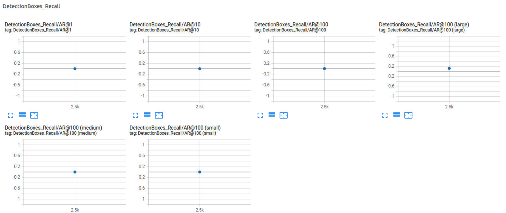

## Submission Template

### Project overview

This project involves using the Tensorflow Object Detection API to identify cars, pedestrians and cyclists. Object Detection is an integral part of a self-driving car system as a self-driving car needs to perceive its surroundings and interpret the objects around it accurately in order to make autonomous movements. The current project, which involves only 3 classes of objects - viz. `vehicle`, `pedestria` and `cyclist` - is obviously a highly simplified version of a realistic self-driving car's image identification unit.

### Set up
Please refer to `README.md` in the project root folder.

### Dataset

#### Dataset analysis

The dataset contains 1719 images in total across all tfrecords in the `data/train` folder. Some sample images with bounding boxes of objects are shown below. The color code is: red for `vehicle`,  blue for `pedestrian` and green for `cyclist`.


<br> </br>
We observe the occurrence frequency to be the highest for `vehicle` (29710), followed by `pedestrian` (8355), followed by `cyclist` (214). As such there definitely is strong imbalance
in the classes that appear in our dataset.


<br/><br/>
The basic statistics for each of these classes are shown below. To get an idea about the variability of aspect ratio (= width/height) and diagonal-size of bounding boxes for each class (in pixels), we plot the individual class histograms as well:
<br> </br>
##### Vehicle


<br> </br>

##### Pedestrian


<br> </br>

##### Cyclist


### Training

#### Reference experiment

The reference training is directly run with config file produced after running `edit_config.py` file.

- `batch_size: 2`
- `num_steps: 2500`

**Runtime Modification**
- `checkpoint_every_n = 500`

We have the following result from training:


The total train/eval loss is clearly very high(~5) and the training was very erratic as the loss fluctuated quite wildly during the training.

The evaluation plots are shown below:
 

The average precision and recall are quite poor (close to zero) in general.

The eval result side by side on image 1 is:


Evidently no bounding boxes are detected.

The inference video also shows no bounding boxes.


#### Improve on the reference
We use data augmentation to improve on the reference experiment. The augmentations employed are
```sh
data_augmentation_options {
    random_crop_image {
      min_object_covered: 0.0
      min_aspect_ratio: 0.75
      max_aspect_ratio: 3.0
      min_area: 0.75
      max_area: 1.0
      overlap_thresh: 0.0
    	}
    }
  data_augmentation_options{
      random_rgb_to_gray{
      probability: 0.2
      }
    }
  data_augmentation_options{
      random_horizontal_flip{
      probability: 0.2
      }
  }
  data_augmentation_options{
  	random_adjust_brightness{
    max_delta:0.3
    }
  }
 data_augmentation_options{
  	random_adjust_contrast{
    min_delta:0.7
    max_delta: 1.4
    }
  }
  data_augmentation_options{
  	random_adjust_hue{
	max_delta: 0.05
    }
  }
  data_augmentation_options{
  	random_image_scale{
    min_scale_ratio: 0.8
    max_scale_ratio: 1.3
    }
  }
```

These augmentations, in part, will change the contrast, hue, brightness and lighting conditions and are expected to help the model generalise better.

From the `Explore augmentations.ipynb` notebook, we can check out some sample images after these augmentation effects.


The above augmentations were employed in the experiments. The experiments are labelled as `EXP-01`, `EXP-02` etc.

##### EXP-01

**Changes to the config file**

- `batch_size: 4`
- `num_steps: 2500`
-   ```sh
cosine_decay_learning_rate {
          learning_rate_base: 0.0004
          total_steps: 2500
          warmup_learning_rate: 0.0002
          warmup_steps: 200
        }
  ```

**Runtime Modification**
- `checkpoint_every_n = 1000`

We have the following result from training:

The total loss has dropped to ~0.75 for training and ~0.9 for eval.

The evaluation plots are shown below:
 

The mAP is ~0.1.

The eval result side by side on image 1 is:


The inference video also starts to show some bounding boxes.


Remarks: This spells some good news for us. For one, we have some bounding boxes. Unfortunately we ran this for 2500 steps with a checkpoint frequency (`checkpoint_every_n`) of 1 per 1000 steps. So instead of having the model from the last step after training, we could only retrieve model results from training after 2000 steps.

Another issue is that the fluctuations in the loss can be reduced by choosing a higher `batch_size`. This should be accompanied by increase in the `learning_rate`. We rectify this with a subsequent improved run.

##### EXP-02

**Changes to the config file**

After looking at the aspect_ratios distribution, we see that the class `pedestrian` has a mean aspect ratio of 0.33 and class `cyclist` has the same around 0.42. Inspired by this, we add an `aspect_ratio` of 0.33 to the config file.

To reduce overfitting during training, we also add dropout this time.

- `batch_size: 8`
- `num_steps: 3000`
-  Added `aspect_ratios: 0.33`
-  Changed `scales_per_octave: 3`
- ```sh
weight_shared_convolutional_box_predictor {
  ...
  use_dropout: true
  dropout_keep_probability: 0.8
}
```
- ```sh
learning_rate {
        cosine_decay_learning_rate {
          learning_rate_base: 0.001
          total_steps: 3500
          warmup_learning_rate: 0.0002
          warmup_steps: 300
        }
  ```

**Runtime Modification**
- `checkpoint_every_n = 1000`

We have the following result from training:


The train loss reduces to ~0.6 and eval loss is ~0.79.

The evaluation plots are shown below:
 

The mAP is slightly under 0.2.

The eval result side by side on image 1 is:


Compared to `EXP-01`, we have improved a bit more as the eval image shows some more bounding boxes!

The inference video for all three test records are shown below.


##### EXP-03

**Changes to the config file**

Relative to EXP-02, EXP-03 is not very different, except that within the post processing function we change the `batch_non_max_suppression` hyperparameters increasing the `score_threshold` to `0.2` and setting `use_class_agnostic_nms` to `true`.

The inspiration for this modification comes from the third animation video produced from `EXP-02`. If you observe closely, the third video clearly shows a lot of bounding boxes in crowded places. Presumably, the model gets confused by the overlap of images of several objects and produces a lot of bounding boxes. We tried to use `use_class_agnostic_nms` and a non zero `score_threshold` here hoping for some final improvements.

- `batch_size: 8`
- `num_steps: 3000`
-  Added `aspect_ratios: 0.33`
-  Changed `scales_per_octave: 3`
- ```sh
weight_shared_convolutional_box_predictor {
  ...
  use_dropout: true
  dropout_keep_probability: 0.8
}
```
- ```sh
learning_rate {
        cosine_decay_learning_rate {
          learning_rate_base: 0.001
          total_steps: 3500
          warmup_learning_rate: 0.0002
          warmup_steps: 300
        }
  ```
-  ```sh
    batch_non_max_suppression {
        score_threshold: 0.2
        iou_threshold: 0.6
        max_detections_per_class: 200
        max_total_detections: 300
        use_static_shapes: false
        use_class_agnostic_nms: true
      }
    ```

**Runtime Modification**
- `checkpoint_every_n = 1000`

We have the following result from training:


The evaluation plots are shown below:
 

The train/eval results are quite similar to `EXP-02`. So the change in post processing did not really do much to improve the efficiency of our model.

The eval result side by side on image 1 is:


The inference videos this time are:


#### Summary

 We improved significantly on the reference experiment with our trial experiments by using data augmentation options that alter the brightness, color, hue, contrast, or perform random horizontal flips etc. With these improvements we could improve the mAP to slightly under 0.2.

There still is quite some scope for improvement:

- The detection of small images is still difficult for the model.
- Crowded places present difficulty in that the model produces a lot of bounding boxes.
- Night time detection could become better.
- Sometimes the model produces false positives as can be inferred from the animations.

It would be interesting to see how a more complex model, further augmentations (e.g. decreasing image quality) and more data could improve the quality of image detection.

##### References Used for Configuring the Config File

###### Reading tfrecords

1. [Eric Thomson Github](https://github.com/EricThomson/tfrecord-view)

2. [Sulc Github](https://github.com/sulc/tfrecord-viewer)

3. [TFRecord Official Documentation](https://www.tensorflow.org/tutorials/load_data/tfrecord)

###### Pipeline Configuration

4. [Neptune AI, TFOD - Part I](https://neptune.ai/blog/how-to-train-your-own-object-detector-using-tensorflow-object-detection-api)

5. [Neptune AI, TFOD - Part II](https://neptune.ai/blog/tensorflow-object-detection-api-best-practices-to-training-evaluation-deployment)

6. [Facebook team's paper on SGD training](https://arxiv.org/abs/1706.02677)
